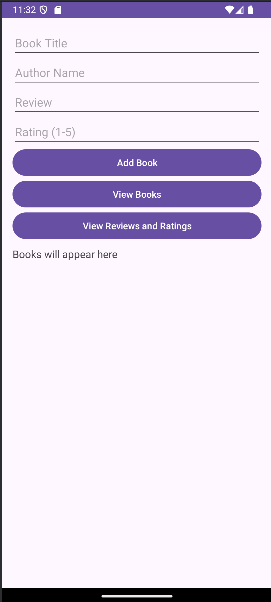

# 📚 BookTrackerApp

A simple Android app to help you keep track of books you've read, along with reviews and ratings. This app uses an SQLite database to store book information locally on your device.

## ✨ Features

- Add books with:
  - Title
  - Author
  - Review
  - Rating (1–5)
- View a list of all added books
- View reviews and ratings separately

## 🛠 Tech Stack

- **Language:** Java  
- **Platform:** Android  
- **Database:** SQLite  
- **Minimum SDK:** 21 (Android 5.0 Lollipop)

## 📸 Screenshots




## 🧑‍💻 How It Works

- The app consists of a single screen with input fields and buttons.
- Users input book details and press **Add Book** to save it to the database.
- **View Books** shows the title and author of all books.
- **View Reviews and Ratings** displays each book’s review and rating.

## 🧱 Database Schema

SQLite table: `books`

| Column      | Type    |
|-------------|---------|
| id          | INTEGER PRIMARY KEY AUTOINCREMENT |
| book_title  | TEXT    |
| author_name | TEXT    |
| review      | TEXT    |
| rating      | TEXT    |

## 🚀 Getting Started

1. Clone this repository:
   ```bash
   https://github.com/mycode05/BookTrackerApp.git

